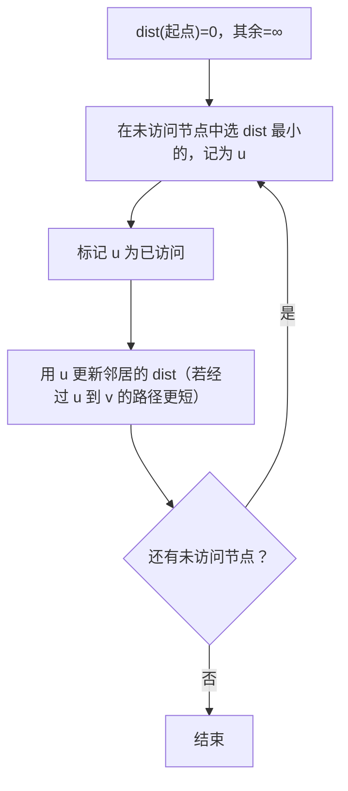
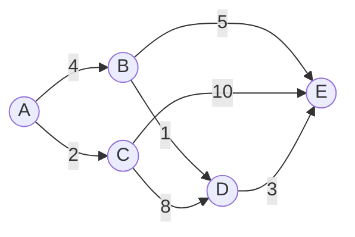

# Dijkstra 最短路径算法

> 荷兰计算机科学家 Edsger W. Dijkstra 于 1956 年提出，用于计算图中**单源最短路径**。

---

## 问题描述

给定一个**带权有向图**和一个**起点**，找出从起点到图中所有其他节点的最短路径。

---

## 核心思想

> 维护 `dist(v)`，记录从起点到每个节点 `v` 的**当前已知最短距离**。
> 每次从未访问的节点中选出 `dist` 最小的节点，用它去更新邻居的距离，重复直到所有节点都被访问。

`dist(v)` 表示当前已知的从起点到 `v` 的最短距离。初始时 `dist(起点) = 0`，其余为 `∞`。随着算法的推进，找到更短路径时 `dist(v)` 会不断缩小。

---

## 算法流程



---

## 逐步推演

以 A 为起点：



| 步 | 选中 | dist(A) | dist(B) | dist(C) | dist(D) | dist(E) | 操作 |
|----|------|---------|---------|---------|---------|---------|------|
| 0 | — | **0** | ∞ | ∞ | ∞ | ∞ | 初始化 |
| 1 | **A** | 0 | 4 | **2** | ∞ | ∞ | 选中 A，更新 B(4)、C(2) |
| 2 | **C** | 0 | 4 | 2 | 10 | **12** | 选中 C，更新 D(10)、E(12) |
| 3 | **B** | 0 | 4 | 2 | **5** | 9 | 选中 B，更新 D(10→5)、E(12→9) |
| 4 | **D** | 0 | 4 | 2 | 5 | **8** | 选中 D，更新 E(9→8) |
| 5 | **E** | 0 | 4 | 2 | 5 | 8 | 完成 |

> 最短路径：A → B(4) → D(1) → E(3) = **8**

---

## 伪代码

```
Dijkstra(G, start):
    for each vertex v in G:
        dist(v) = ∞
        prev(v) = null
        mark v as unvisited

    dist(start) = 0

    while true:
        pick u = unvisited vertex with smallest dist(u)
        if no such u or dist(u) = ∞: break
        mark u as visited

        for each neighbor v of u:
            candidate = dist(u) + weight(u, v)
            if candidate < dist(v):
                dist(v) = candidate
                prev(v) = u
```

---

## 复杂度分析

> $V$ = 顶点数，$E$ = 边数

| 实现方式 | 时间 | 空间 |
|---------|------|------|
| 数组（朴素） | $O(V^2)$ | $O(V)$ |
| 二叉堆 | $O((V+E)\log V)$ | $O(V+E)$ |
| 斐波那契堆 | $O(V\log V + E)$ | $O(V)$ |

---

## 局限性

- **不支持负权边**（有负权请用 Bellman-Ford）
- **仅限单源**（全源最短路径请用 Floyd-Warshall）

---

## 在 Lean 4 中证明

要用 Lean 验证 Dijkstra 算法，需要形式化以下性质：

1. **终止性**：每次迭代访问一个节点，$V$ 有限 → 算法必然结束
2. **不变式**：已访问节点的 `dist` 就是最终最短距离
3. **正确性**：算法结束时，所有 `dist(v)` 均为正确的最短路径长度

---
