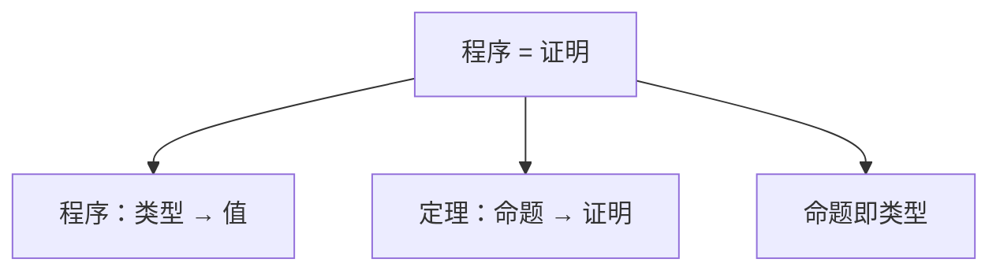

# Lean 4 TLDR

> 一份精炼的 Lean 4 速查手册，涵盖核心概念、语法、证明技巧和项目实践。

---

## 目录

1. [核心哲学](#1-核心哲学)
2. [项目结构 & 构建](#2-项目结构--构建)
3. [基础语法](#3-基础语法)
4. [类型系统](#4-类型系统)
5. [函数式编程](#5-函数式编程)
6. [自定义类型](#6-自定义类型)
7. [类型类](#7-类型类)
8. [do 记法与 IO](#8-do-记法与-io)
9. [证明入门](#9-证明入门)
10. [常用策略](#10-常用策略)
11. [命令行速查](#11-命令行速查)
12. [# 命令](#12--命令)
13. [常见模式](#13-常见模式)
14. [推荐资源](#14-推荐资源)

---

## 1. 核心哲学



- **纯函数式** — 所有表达式无副作用，副作用通过 `IO` 类型显式管理
- **依值类型** — 类型可以依赖值（如 `Vector α n`，长度为 `n` 的向量）
- **证明与程序合一** — 用同一门语言写代码和证明
- **可判定检查** — 类型检查器保证所有证明逻辑正确

---

## 2. 项目结构 & 构建

### 典型项目布局

```
my_project/
├── lakefile.toml          # Lake 构建配置
├── lean-toolchain          # Lean 版本声明
├── Main.lean               # 可执行文件入口（可选）
├── MyLib.lean              # 库根模块
├── MyLib/
│   ├── Basic.lean          # 子模块
│   └── Util.lean
└── .vscode/
    └── lean4.code-snippets # 代码片段
```

### `lakefile.toml` 配置

```toml
name = "my_project"
version = "0.1.0"
defaultTargets = ["my_project"]

[[lean_lib]]
name = "MyLib"                          # 库目标

[[lean_exe]]
name = "my_project"                         # 可执行文件目标
root = "Main"

[[require]]
name = "mathlib"
git  = "git@github.com:leanprover-community/mathlib4.git"
rev = "v4.31.0"
```

### 常见命令

```
lake build         # 构建所有目标
lake build MyLib   # 仅构建库
lake exe my_project   # 直接运行可执行文件
lake clean         # 清理构建产物
lake update        # 更新依赖
```

---

## 3. 基础语法

### 注释

```lean4
-- 单行注释

/-
  多行注释块
-/

/-- 文档注释（doc-string），出现在定义之前 -/

/-!
模块级文档注释，通常放在 import 之后
-/
```

### 定义

```lean4
def hello : String := "Hello"            -- 常量
def add (x y : Nat) : Nat := x + y       -- 函数
def add' (x y : Nat) := x + y            -- 返回类型可省略（自动推导）
```

### 变量绑定

```lean4
let x := 5                               -- 局部不可变绑定
let y : Nat := 5                         -- 带类型标注
```

### 字符串插值

```lean4
s!"value = {x}, double = {x * 2}"        -- 类似 Python f-string
```

### 条件表达式

```lean4
if x > 0 then "positive" else "non-positive"

-- if 是表达式，必有返回值
```

### 模式匹配

```lean4
match xs with
| []      => "empty"
| x :: rest  => s!"head: {x}, rest size: {rest.length}"

-- as 模式：同时绑定整体和分解后的部分
match xs with
| []                => "empty"
| all@(x :: rest)   => s!"head: {x}, rest size: {rest.length}, all: {all}"
-- all 绑定整个 x :: rest，可同时使用整体和分解后的部分
```

### 匿名函数

```lean4
λ x => x + 1
fun x => x + 1                            -- λ 和 fun 等价
fun (x : Nat) (y : Nat) => x + y          -- 多参数（柯里化形式）
```

### 管道操作符

```lean4
xs |> List.map f |> List.filter p         -- 类似 Unix pipe
```

---

## 4. 类型系统

### 基本类型

| 类型 | 说明 | 示例 |
|------|------|------|
| `Nat` | 自然数（任意大） | `0`, `42` |
| `Int` | 整数 | `-5` |
| `Float` | 浮点数 | `3.14` |
| `Bool` | 布尔值 | `true`, `false` |
| `String` | 字符串 | `"hello"` |
| `Char` | 字符 | `'a'` |
| `Unit` | 单元类型 | `()` |
| `α × β` | 二元组 | `(1, "a")` |
| `α → β` | 函数类型 | `Nat → String` |

### 复合类型

```lean4
-- 列表（链表）
List Nat           -- [1, 2, 3]

-- 数组（连续内存）
Array String       -- #[]

-- Option（可选值）
Option Nat         -- none 或 some 42

-- Union（联合类型）
Sum String Nat     -- inl "err" 或 inr 42
```

### 类型层级

```lean4
#check Type          -- Type : Type 1
#check Type 1        -- Type 1 : Type 2
#check Prop          -- Prop : Type   （命题的类型）

-- Sort 包含所有层级
-- Sort 0 = Prop
-- Sort 1 = Type
-- Sort 2 = Type 1 ...
```

---

## 5. 函数式编程

### 高阶函数

```lean4
List.map (fun x => x + 1) [1, 2, 3]      -- [2, 3, 4]
List.filter (λ x => x > 2) [1, 2, 3, 4]  -- [3, 4]
List.foldl (· + ·) 0 [1, 2, 3]           -- 6
```

### 柯里化

```lean4
def add (x y : Nat) := x + y
-- 实际类型：Nat → Nat → Nat
-- 等价于：  Nat → (Nat → Nat)

(add 1) 2    -- 3，部分应用
```

### 递归

```lean4
def fact : Nat → Nat
  | 0     => 1
  | n + 1 => (n + 1) * fact n

-- 结构递归：编译器自动检查终止
def fib : Nat → Nat
  | 0     => 0
  | 1     => 1
  | n + 2 => fib (n + 1) + fib n
```

---

## 6. 自定义类型

### 结构体

```lean4
structure Person where
  name : String
  age  : Nat
  deriving Repr, DecidableEq

-- 创建
def alice : Person := { name := "Alice", age := 30 }

-- 访问
alice.name          -- "Alice"
alice.age           -- 30

-- 更新（函数式）
{ alice with age := 31 }

-- 解构
let { name, age } := alice
```

### 归纳类型（代数数据类型）

```lean4
inductive Color where
  | Red | Green | Blue
  deriving Repr

-- 带参数
inductive Tree (α : Type) where
  | leaf : Tree α
  | node : α → Tree α → Tree α → Tree α
  deriving Repr

-- 递归函数
def Tree.size : Tree α → Nat
  | .leaf       => 0
  | .node _ l r => 1 + size l + size r
```

### 互递归

```lean4
mutual
  def even : Nat → Bool
    | 0 => true
    | n + 1 => odd n

  def odd : Nat → Bool
    | 0 => false
    | n + 1 => even n
end
```

---

## 7. 类型类

类型类是 Lean 的**接口/协议/特质**机制（类似 Rust `trait` 或 Haskell `typeclass`）。

### 定义与实例

```lean4
-- 定义类型类
class Serializable (α : Type) where
  serialize : α → String

-- 实现实例
instance : Serializable Nat where
  serialize n := toString n

-- 带参数的实例
instance [Serializable α] : Serializable (List α) where
  serialize xs := "[" ++ String.intercalate ", " (List.map Serializable.serialize xs) ++ "]"
```

### 使用

```lean4
-- 泛型函数
def printIt [Serializable α] (x : α) : String :=
  Serializable.serialize x

-- 实例隐式自动传递
#eval printIt 42              -- "42"
#eval printIt [1, 2, 3]       -- "[1, 2, 3]"
```

### 常见内置类型类

| 类型类 | 说明 |
|--------|------|
| `Repr` | 可表示（`#eval` 使用） |
| `ToString` | 可转字符串 |
| `BEq` | 布尔相等性 |
| `DecidableEq` | 可判定相等性（可用来证明） |
| `Hashable` | 可哈希 |
| `Ord` | 可比较 |
| `Inhabited` | 有默认值 |
| `Add`, `Mul`, `OfNat` | 数值运算 |

---

## 8. do 记法与 IO

### 基础 IO

```lean4
def main : IO Unit :=
  IO.println "Hello, Lean!"

-- 字符串插值
IO.println s!"count = {count}"
```

### do 记法（顺序执行）

```lean4
def main : IO Unit := do
  let name ← IO.FS.readFile "input.txt"   -- ← 解包 IO String → String
  IO.println s!"Read {name}"
  IO.FS.writeFile "output.txt" name
```

### ← 与 let 的区别

```lean4
-- let:  直接绑定（纯值绑定）
-- ←:    从单子中提取值（此处从 IO 中提取）

let x := 42                               -- x : Nat
let y ← IO.getLine                       -- y : String（从 IO String 提取）
```

### 常用 IO 函数

```lean4
IO.println       -- 打印带换行
IO.print         -- 打印不带换行
IO.getLine       -- 读一行
IO.FS.readFile   -- 读文件
IO.FS.writeFile  -- 写文件
IO.FS.dirExists  -- 检查目录是否存在
```

### 异常处理

```lean4
try
  let content ← IO.FS.readFile "may_not_exist.txt"
  IO.println content
catch e =>
  IO.println s!"Error: {e}"
```

---

## 9. 证明入门

### 什么是证明？

在 Lean 中，一个**命题**就是一个类型，**证明**就是这个类型的值：

```lean4
-- 命题：1 + 1 = 2
example : 1 + 1 = 2 := rfl    -- rfl 表示「根据定义相等」

-- 命题：对于任意 n，n + 0 = n
theorem add_zero (n : Nat) : n + 0 = n := by
  induction n with
  | zero => rfl
  | succ n ih => simp [Nat.add_succ, ih]
```

### 证明方式

#### 1. 项模式（直接构造）

```lean4
example : 1 + 1 = 2 := rfl
example : 2 + 2 = 4 := rfl
```

#### 2. 策略模式（`by` 块）

```lean4
example : 2 + 2 = 4 := by
  native_decide        -- 让 Lean 自动计算
```

```lean4
example (h : a = b) (h' : b = c) : a = c := by
  rw [h, h']           -- 重写
```

#### 3. calc 模式（等式链）

```lean4
example (a b c : Nat) (h1 : a = b) (h2 : b = c) : a = c := by
  calc
    a = b := h1
    _ = c := h2
```

### 命题类型

```lean4
a = b         -- 等式
a ≠ b         -- 不等（a = b → False 的简写）
True          -- 真命题（总是可证）
False         -- 假命题（不可证）
¬ P           -- 非 P
P ∧ Q         -- 且
P ∨ Q         -- 或
P → Q         -- 蕴含
∀ x, P x      -- 任意
∃ x, P x      -- 存在
```

---

## 10. 常用策略

### 核心策略

| 策略 | 用途 | 示例 |
|------|------|------|
| `rfl` | 根据定义相等闭合目标 | `rfl` |
| `simp` | 利用引理简化目标 | `simp [add_comm]` |
| `rw` | 用等式重写 | `rw [h]` / `rw [← h]` |
| `apply` | 将定理应用到目标 | `apply add_comm` |
| `exact` | 直接给出精确证明 | `exact h` |
| `intro` | 引入前提 / ∀ 变量 | `intro n` |
| `refine` | 带 ?_ 占位符的 `exact` | `refine add_comm ?_ ?_` |

### 结构化策略

| 策略 | 用途 |
|------|------|
| `induction h` | 对 h 进行归纳 |
| `cases h` | 对 h 分情况讨论 |
| `constructor` | 拆分 ∧ 或 ∨ 目标 |
| `left` / `right` | 选择 ∨ 的哪一侧 |
| `split` | 处理 if 分支 |
| `rename` | 重命名假设 |

### 算术与自动化

| 策略 | 用途 |
|------|------|
| `omega` | 线性算术（Nat/Int） |
| `native_decide` | 自动判定有限可判定命题 |
| `dec_trivial` | 判定可判定命题（旧版本） |
| `aesop` | 启发式自动证明搜索 |
| `nlinarith` | 非线性算术（需要 mathlib） |

### 逻辑策略

| 策略 | 用途 |
|------|------|
| `by_contra h` | 反证法 |
| `have h : P := ...` | 引入中间断言 |
| `obtain ⟨h1, h2⟩ := h` | 解构 ∧ 或 ∃ |
| `specialize h a` | 实例化 ∀ 量词 |

### 策略组合

```lean4
-- 续行（· 表示当前目标）
example (h : A) (h' : B) : A ∧ B := by
  constructor
  · exact h
  · exact h'

-- ; 组合
constructor <;> simp

-- first / solve
first | apply h | rfl
```

---

## 11. 命令行速查

### Lake 构建系统

| 命令 | 说明 |
|------|------|
| `lake build` | 构建所有目标 |
| `lake build MyLib` | 构建指定库 |
| `lake exe my_project` | 运行可执行文件 |
| `lake clean` | 清理构建产物 |
| `lake update` | 更新所有依赖至最新 |
| `lake new project` | 创建新项目 |
| `lake env lean --stdin` | 启动交互式 REPL |
| `lake env lean file.lean` | 编译单个文件 |

### Elan（Lean 版本管理器）

| 命令 | 说明 |
|------|------|
| `elan default stable` | 设置默认频道 |
| `elan toolchain list` | 列出已安装版本 |
| `lean --version` | 查看当前 Lean 版本 |

---

## 12. `#` 命令

这些命令在 Lean 文件中使用，只在 IDE / REPL 中生效（编译时会被忽略）。

| 命令 | 作用 | 示例 |
|------|------|------|
| `#eval expr` | 计算表达式并打印结果 | `#eval 1 + 2` → `3` |
| `#check expr` | 显示类型 | `#check 42` → `42 : Nat` |
| `#reduce expr` | 归约到范式 | `#reduce (List.range 5).reverse` |
| `#print def` | 打印定义 | `#print Nat.succ` |
| `#check` | 可查看类型类和实例 | `#check add` |
| `#help` | 列出所有可用命令 | |

---

## 13. 常见模式

### 模式 1：模块文件模板

```lean4
/- Copyright (c) 2026. All rights reserved. -/
import Mathlib

/-!
# ModuleName
-/

namespace MyNamespace

set_option pp.unicode.fun true   -- 输出使用 → 而非 fun

-- ... definitions ...

end MyNamespace
```

### 模式 2：结构体 + 导航函数

```lean4
structure Point where
  x : Float
  y : Float

def Point.dist (a b : Point) : Float :=
  Float.sqrt ((a.x - b.x)^2 + (a.y - b.y)^2)
```

### 模式 3：递归 + 不变式

```lean4
/-- 列表求和，附带长度不变式 -/
def sum (xs : List Nat) : Nat :=
  match xs with
  | []    => 0
  | h :: t => h + sum t

/-- 证明空列表求和为 0 -/
theorem sum_nil : sum [] = 0 := rfl
```

### 模式 4：类型类 + 泛型编程

```lean4
class Monoid (α : Type) where
  mempty : α
  mappend : α → α → α

instance : Monoid Nat where
  mempty := 0
  mappend := (· + ·)
```

### 模式 5：IO 程序

```lean4
def main : IO Unit := do
  let stdin ← IO.getLine
  let name := stdin.trim
  IO.println s!"Hello, {name}!"
```

### 模式 6：使用 mathlib

```lean4
import Mathlib

#eval Nat.prime 7            -- true
#eval Nat.sqrt 16            -- 4
#eval (List.range 10).sum   -- 45
```

---

## 14. 推荐资源

| 资源 | 链接 |
|------|------|
| Lean 4 官方手册 | <https://lean-lang.org/lean4/doc/> |
| Functional Programming in Lean | <https://lean-lang.org/functional_programming_in_lean/> |
| Theorem Proving in Lean 4 | <https://lean-lang.org/theorem_proving_in_lean4/> |
| Mathlib 文档 | <https://leanprover-community.github.io/mathlib4_docs/> |
| Lean 4 Playground | <https://live.lean-lang.org/> |
| Lean 社区 Zulip | <https://leanprover.zulipchat.com/> |
| Lean 4 标准库 API | `#print` / `#check` 可在 IDE 中直接使用 |

---

> **TL;DR 一句话总结**：Lean 4 是一门**函数式编程语言 + 证明助手**，你可以用它写普通程序、做形式化证明、或者两者结合——所有「类型检查通过」的程序都不会在运行时崩溃，且所有证明都是机器可验证的。
