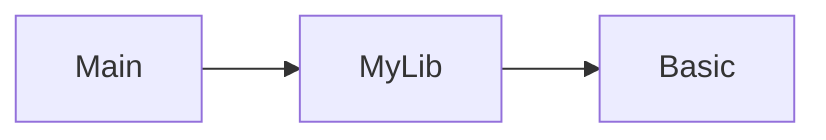

# 项目概述

`my_tea` 是一个用 Lean 4 编写的项目。

## 项目结构

```
my_tea/
├── Main.lean             # 可执行文件入口
├── MyLib.lean            # 库根模块
├── MyLib/                # 库模块
│   └── Basic.lean        # 基础模块
├── docs/                 # 文档
├── .vscode/              # 编辑器配置
├── .github/              # 持续集成
├── lakefile.toml         # 构建配置
├── lean-toolchain        # 版本声明
├── lake-manifest.json    # 依赖锁定
├── LICENSE
└── README.md
```

### 模块依赖



## 常用命令

| 命令 | 说明 |
|------|------|
| `lake build` | 构建所有目标 |
| `lake exe my_tea` | 运行可执行文件 |
| `lake update` | 更新依赖 |
| `lake clean` | 清理构建产物 |

## 代码风格

- 2 空格缩进
- `PascalCase` 类型，`camelCase` 函数

## 持续集成

`.github/workflows/ci.yml` — 代码合并到 `main` 分支时自动执行 `CI`。

## 版本

- Lean：`leanprover/lean4:v4.31.0`
- my_tea：`my_tea:v0.1.0`（版本号由 `lakefile.toml` 定义）
